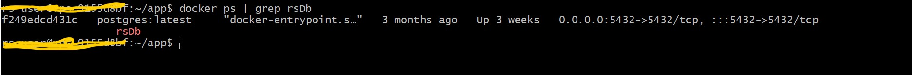
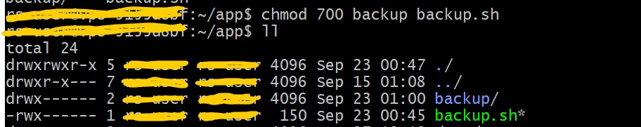
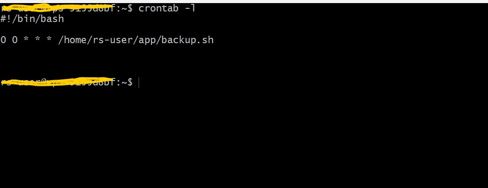

# Backup PostgreSQL Database in Docker Using Cron Job (Crontab)


## Introduction:

In a Dockerized environment, ensuring the security and integrity of your PostgreSQL database is crucial. Regular backups are a vital component of any disaster recovery strategy. In this article, we will explore how to automate the backup process of a PostgreSQL database running in a Docker container using the powerful cron job scheduler.

### _What is Crontab?_

Crontab is a Unix-based utility that allows users to schedule tasks to run automatically at specific intervals. By utilizing cron job scheduling, administrators can automate repetitive tasks, such as database backups, with ease.

#### Prerequisites
- [Basic knowledge on Docker](https://devopssec.fr/article/cours-complet-apprendre-technologie-docker) 
- [Run Postgres Image on Docker](https://www.docker.com/blog/how-to-use-the-postgres-docker-official-image)
- [Basic knowledge of Cron](https://www.docker.com/blog/how-to-use-the-postgres-docker-official-image)

#### Step 1: Verify PostgreSQL database running on Docker
Before proceeding, make sure you have Docker installed on your system and PostgreSQL containers is running.



#### Step 2: Creating a Backup Script

Next, let's create a shell script that will perform the backup operation. Open a text editor and create a new file named `backup.sh` with the following contents:
```shell
#!/bin/bash

docker exec rsDb pg_dump -U your_postgres_username -d your_postgres_database > /your_backup_directory/backup_$(date +\%Y-\%m-\%d-\%H:\%M).sql
```

Make sure to replace `/your_backup_directory` with the actual path where you want to store your backups. This script utilizes the `docker exec` command to execute the `pg_dump` utility inside the `my-postgresql` container, dumping the entire database to a file named based on the current date and time.

#### Step 3: Restrict access backup script file and backup directory

For greater security, only the user performing the task should have access to the script and the backup folder. To do this, you can use the following commands:



#### Step 4: Setting Up the Cron Job

To schedule the backup script to run automatically, we need to add an entry to the crontab file. Open a terminal and execute the following command:

```shell
crontab -e
```
This will open the crontab file in your default text editor. Add the following line at the end of the file:

```shell
0 0 * * * /bin/bash /path/to/backup.sh
````
This entry tells cron to execute the backup script every day at midnight (00:00). Make sure to replace `/your-directory/backup.sh` with the actual path to the `backup.sh` script.

Save the crontab file and exit the editor. The cron job is now scheduled to run automatically.

- To Check the cron job list you can use the following command:

```shell
crontab -l
```



#### Bonus: 
- To restore a particular backup you can run the following command : 

```shell
cat your_backup.sql | docker exec -i your-db-container psql -U your_postgres_username -d your_postgres_database
````

- To provide more security for your cron job, create `cron.allow` file in `/etc` directory and put there only users authorised to run job. Follow this [link](https://docs.oracle.com/cd/E19253-01/817-0403/sysrescron-23/index.html) to get more details.

## Conclusion:

In this article, we learned how to automate the backup process of a PostgreSQL database running in a Docker container using cron job scheduling. Regularly backing up your database ensures that you have a recent copy in case of any data loss or system failure. By utilizing cron job scheduling, you can streamline this important task and focus on other crucial aspects of your application.


##### Thank you and Follow me! 🤗

* medium: https://urlz.fr/nIXh
* LinkedIn: https://www.linkedin.com/in/mouhamad-diack-b0b1541a3/
* Discord: https://discord.com/users/845331863018274836
* Portfolio: https://md-portfolio.carrd.co/